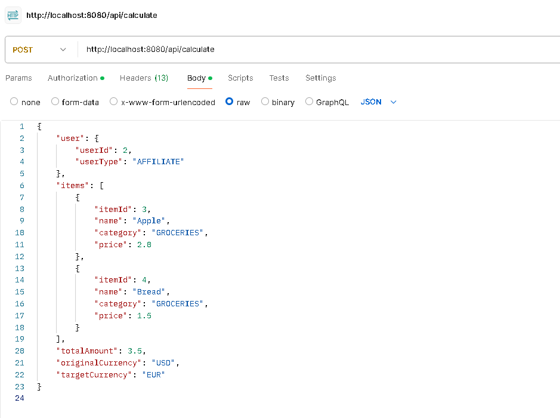
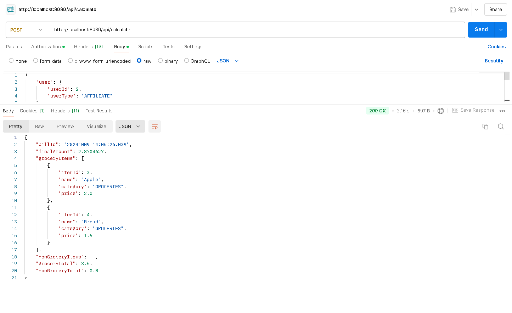
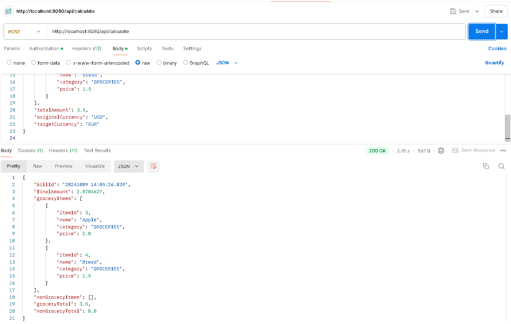
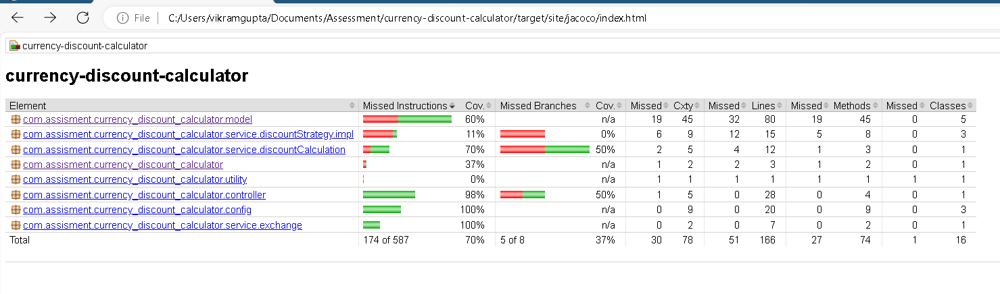

`# Currency Discount Calculator

## Overview

The Currency Discount Calculator is a Spring Boot application that calculates the final amount to be paid after applying discounts based on user types (Employee, Affiliate, Customer) and converting the total amount to a specified currency. The application utilizes a strategy design pattern to apply different discount strategies based on the user type.

## Features

- **Discount Calculation**: Calculates discounts for different user types using the Strategy Pattern.
- **Currency Conversion**: Converts the final amount to a target currency based on real-time exchange rates.
- **RESTful API**: Provides an endpoint to calculate the total amount based on user details and item list.

## Technologies Used

- Java 17
- Spring Boot 3.4.4
- Spring Web
- Spring Security (optional, for token-based authentication)
- JUnit 5
- Mockito for unit testing

## UML Class Diagram


## Setup

### Prerequisites

- Java Development Kit (JDK) 17
- Apache Maven
- Redis (for caching, optional)

### Installation

1. **Clone the repository**:
   ```bash
   git clone https://github.com/yourusername/currency-discount-calculator.git
   cd currency-discount-calculator` 

2.  **Build the project**:

    bash

    Copy code

    `mvn clean install`

3.  **Run the application**:

    bash

    Copy code

    `mvn spring-boot:run`

4.  **Access the application**: Open your browser and navigate to `http://localhost:8080/api/calculate`.


## API Usage

### Endpoint

**POST** `/api/calculate`

### Request Body

The request body should be in JSON format as follows:
{
"user": {
"userId": 2,
"userType": "AFFILIATE"
},
"items": [
{
"itemId": 3,
"name": "Apple",
"category": "GROCERIES",
"price": 2.0
},
{
"itemId": 4,
"name": "Bread",
"category": "GROCERIES",
"price": 1.5
}
],
"totalAmount": 3.5,
"originalCurrency": "USD",
"targetCurrency": "EUR"
}`

### Response

{
"billId": "20241009 14:05:26.039",
"finalAmount": 2.8704627,
"groceryItems": [
{
"itemId": 3,
"name": "Apple",
"category": "GROCERIES",
"price": 2.0
},
{
"itemId": 4,
"name": "Bread",
"category": "GROCERIES",
"price": 1.5
}
],
"nonGroceryItems": [],
"groceryTotal": 3.5,
"nonGroceryTotal": 0.0
}

The response will return the converted amount after applying the discounts:




## Testing

To run the unit tests, use the following command:

bash

Copy code

`mvn test`

### Example Test Cases

-   The test cases verify the functionality of discount calculations for different user types.
-   Mocking is utilized for dependencies to ensure isolated testing.

### Test Report



## License

This project is licensed under the MIT License - see the LICENSE file for details.

## Acknowledgments

-   Thanks to the Spring Boot community for their extensive documentation and support.
-   Special thanks to contributors for their feedback and contributions.

## Contributing

If you'd like to contribute to this project, please fork the repository and submit a pull request.

For any issues or feature requests, please create an issue on GitHub.

markdown

Copy code

``### Notes:

- Replace `https://github.com/Vikram-st/project` with the actual URL of your repository.
- Ensure that any specific configuration or dependencies needed for Redis or other components are mentioned under the "Setup" section if applicable.
- This `README.md` provides a structured overview, making it easier for users and developers to understand and contribute to your project.``

4o mini