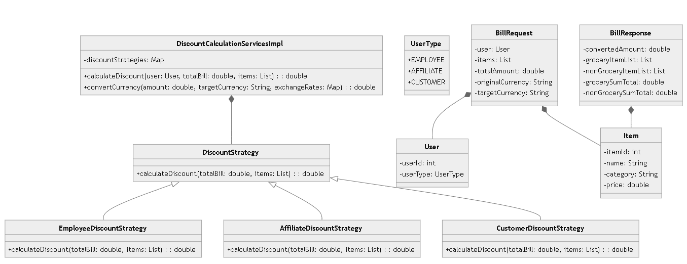

# Currency Discount Calculator

## Overview

The Currency Discount Calculator is a Spring Boot application that calculates the final amount to be paid after applying discounts based on user types (Employee, Affiliate, Customer) and converting the total amount to a specified currency. The application utilizes a strategy design pattern to apply different discount strategies based on the user type.

## Features

- **Discount Calculation**: Calculates discounts for different user types using the Strategy Pattern.
- **Currency Conversion**: Converts the final amount to a target currency based on real-time exchange rates.
- **RESTful API**: Provides an endpoint to calculate the total amount based on user details and item list.

## Technologies Used

- Java 17
- Spring Boot 3.4.4
- Spring Web
- Spring Security (optional, for token-based authentication)
- JUnit 5
- Mockito for unit testing

## UML Class Diagram


## Setup

### Prerequisites

- Java Development Kit (JDK) 17
- Apache Maven
- Redis (for caching, optional)

### Installation

1. **Clone the repository**:
   ```
   git clone https://github.com/yourusername/currency-discount-calculator.git
   cd currency-discount-calculator` 

2.  **Build the project**:

    

    

    `mvn clean install`

3.  **Run the application**:

    

    

    `mvn spring-boot:run`

4.  **Access the application**: Open your browser and navigate to `http://localhost:8080/api/calculate`.


## API Usage

### Endpoint

**POST** `/api/calculate`

### Request Body

The request body should be in JSON format as follows:

``{
"items": [
{
"itemId": "1",
"name": "Laptop",
"category": "NON_GROCERIES",
"price": 1200.0
},
{
"itemId": "2",
"name": "Monitor",
"category": "NON_GROCERIES",
"price": 250.0
},
{
"itemId": "3",
"name": "Apple",
"category": "GROCERIES",
"price": 5.0
}
],
"user": {
"userType": "EMPLOYEE",
"customerTenure": 1
},
    "originalCurrency": "USD",
    "targetCurrency": "EUR"
}``


### Response

`{
"billId": "2024100919:33:51.977",
"finalAmount": 969.9999999999999,
"groceryItems": [
{
"itemId": 3,
"name": "Apple",
"category": "GROCERIES",
"price": 5.0
}
],
"nonGroceryItems": [
{
"itemId": 1,
"name": "Laptop",
"category": "NON_GROCERIES",
"price": 1200.0
},
{
"itemId": 2,
"name": "Monitor",
"category": "NON_GROCERIES",
"price": 250.0
}
],
"groceryTotal": 5.0,
"nonGroceryTotal": 1450.0
}`


## Testing

To run the unit tests, use the following command:


`mvn test`

### Example Test Cases

-   The test cases verify the functionality of discount calculations for different user types.
-   Mocking is utilized for dependencies to ensure isolated testing.

### Test Report


